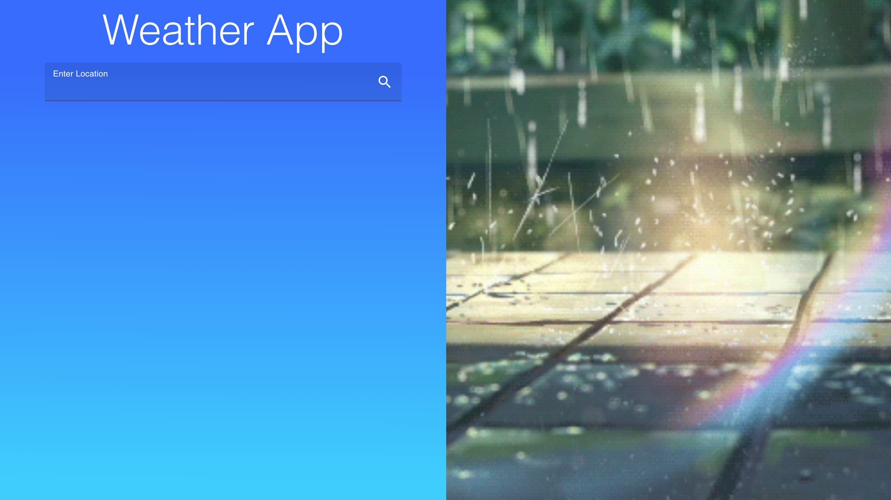
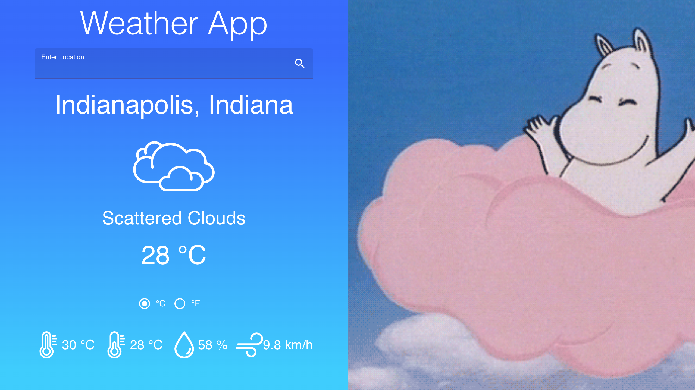
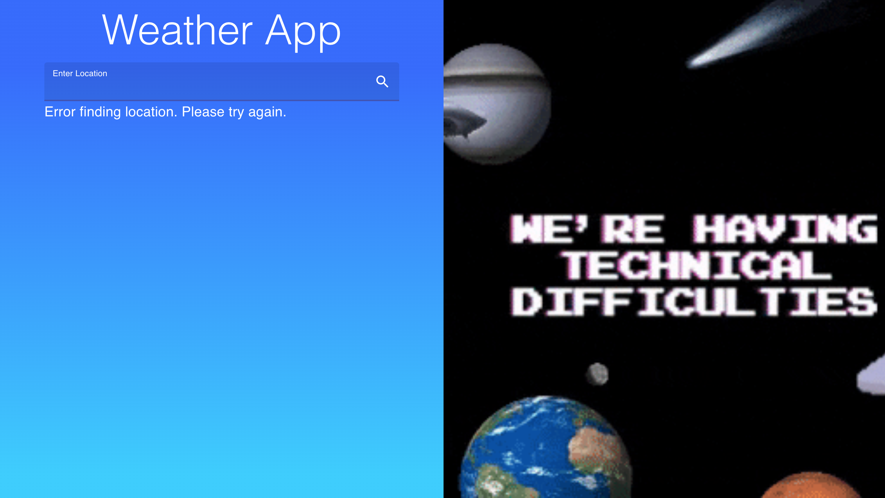

# Weather React App

This is the Weather App project for the Odin Project done in React. It utilizes React function components, as well as Material-UI components, hooks,JSS for the styling, and both the OpenWeather API and Giphy API. Weather as well as a gif related to the current weather are displayed.  

<a href="https://ricardo-gonzalez-villegas.github.io/weather-react-app/">View it here.</a>
<section>
<h2>Technologies Used<h2/>
JSS, JSX, Javascript, React, Material-UI, OpenWeather API, Giphy API
</section>
 
<h1>Home Page</h1>

<h1>Weather</h1>

User can switch between celsius and fahrenheit.

<h1>Error Handling</h1>

